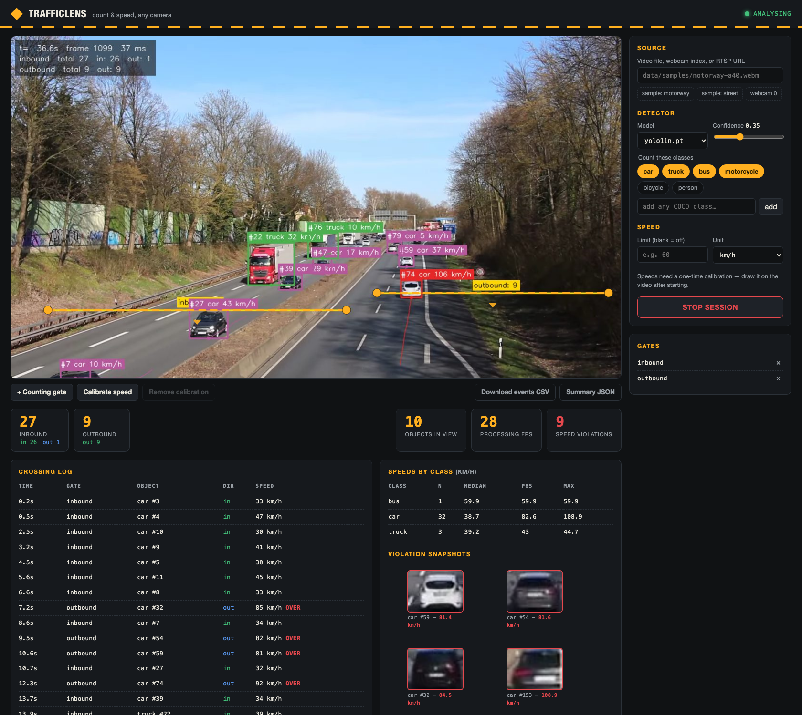
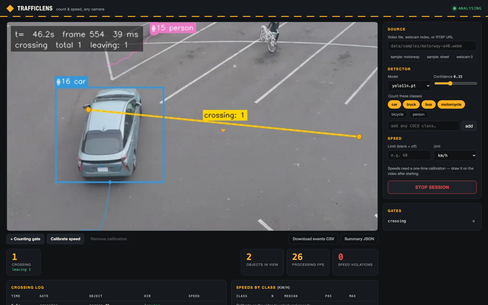

# TrafficLens

**Count and speed-track anything that moves on camera.** TrafficLens turns any video
feed — a traffic camera, an RTSP stream, a video file, a webcam — into live,
auditable traffic analytics: per-class directional counts at virtual gates you draw
on the video, and real km/h speeds from a calibrated road-plane homography. It ships
as a Python package, a CLI, and a browser control room.

**Interactive results dashboard:** https://safdar-hussain1.github.io/trafficlens/ —
it replays a real analysed motorway session (pure tracking data, no video) and lets
you drag the counting gate to recompute counts live.



## What it does

| | |
|---|---|
| **Count anything** | Any COCO class — cars, trucks, buses, motorcycles, bicycles, people. Gates tally by class and by direction (in/out, or your own labels). |
| **Real speeds** | A four-point road-plane homography maps pixels to metres. Uncalibrated cameras report *no* speed — never a pixel-derived guess. |
| **Any source** | Video files, webcam indices, RTSP/HTTP streams. One YAML config drives both the CLI and the web app. |
| **Draw, don't code** | Gates are drawn on the live video and dragged while the session runs. Calibration is four clicks and two numbers. |
| **Violations** | Set a speed limit; every over-limit crossing is flagged, logged, and photographed into a snapshot gallery. |
| **Incidents** | Stopped-vehicle detection (a stalled car, an obstacle, a forming queue: sustained near-zero calibrated speed) and wrong-way alerts on any gate with an expected flow direction. |
| **Exports** | Events CSV, summary JSON, and a replay JSON that powers the dashboard. Every count is auditable down to the frame. |

## Quick start

```bash
git clone https://github.com/safdar-hussain1/trafficlens
cd trafficlens
python -m venv .venv && source .venv/bin/activate
pip install -e ".[dev]"

# fetch the CC-licensed sample clips (~18 MB)
trafficlens fetch-samples

# full analysis of a busy German motorway: counts, speeds, violations
trafficlens run --config configs/motorway.yaml --save-video annotated.mp4

# count people through a doorway with your webcam — no config file needed
trafficlens run --source 0 --classes person --gate "door,0.5,0.05,0.5,0.95"

# the browser control room
trafficlens serve
```

`trafficlens serve` opens http://127.0.0.1:8000: pick a source, press *Start
analysis*, drag a gate across the road, and watch counts, speeds and violations
land in real time.



## Why the counting is right

Most tutorial counters test whether an object's centre point falls inside a thin
pixel band around the counting line. That rule fails in both directions:

- **Misses** — an object moving more pixels per frame than the band is tall can jump
  clean over it. Simulation (`notebooks/01_methodology.ipynb`): a 16 px band catches
  only **53.6%** of crossings at 30 px/frame and **27.6%** at 60 px/frame.
- **Phantoms** — an object that enters the band without crossing (a lane change
  along the line, bounding-box jitter) is counted anyway.

TrafficLens instead fires a count exactly when the **segment between an object's
anchor point on consecutive frames intersects the gate segment**, with the direction
taken from the sign of the side change. That is pure geometry — it cannot miss at
any speed, and it cannot fire without a genuine crossing. Both failure modes of the
band rule are locked in as unit tests
([tests/test_counting.py](tests/test_counting.py)), and the band counter itself is
kept in the repo ([src/trafficlens/baseline.py](src/trafficlens/baseline.py)) so the
benchmark can race the two rules on identical tracker output.

The anchor is the **bottom-centre of the bounding box** — the point where the object
meets the road — not the box centre, which floats mid-air and shifts with
perspective.

## Why the speeds are right

Pixels are not metres: a car near the camera moves hundreds of pixels per frame, the
same car far away moves a handful. TrafficLens computes speed in **road-plane
metres** via a homography fitted from image↔world point correspondences, over a
sliding time window with EMA smoothing. Stationary objects report no speed (jitter
is not movement), and uncalibrated cameras report no speed at all.

For the bundled motorway clip the calibration was surveyed from the road markings
themselves: German autobahn lane dashes repeat every 18 m (6 m paint + 12 m gap), so
five dash starts along the lane divider plus the parallel lane edge give ten
correspondences for a least-squares fit. Validation, three independent ways:

1. **Survey check** — probe rows step 18.0 m ± 0.4 m through the calibrated corridor.
2. **Physical check** — a mid-corridor car footprint measures **4.96 m**; real cars
   are 4.5–5 m.
3. **Exact check** — against synthetic cameras with known ground truth, the
   estimator recovers 36 / 72 / 108 km/h with **0.0% error** at convergence, stays
   within 10% under 1.5 px of detector jitter, and converts km/h↔mph exactly
   ([tests/test_speed.py](tests/test_speed.py)).

Full guide: [docs/CALIBRATION.md](docs/CALIBRATION.md).

## Measured results

Produced by [`scripts/run_benchmark.py`](scripts/run_benchmark.py) on public
CC-licensed footage; every number is reproducible from a clean clone. Model:
`yolo11s.pt` at 960 px input, ByteTrack tracking, Apple M-series GPU (MPS).

### Scenario: A40 motorway, Dortmund (24.5 s, two carriageways, congested Friday traffic)

| metric | 30 fps native | 10 fps (CCTV-like, every 3rd frame) |
|---|---|---|
| crossings, both gates | **28** | **28** |
| inbound gate | 14 car + 3 truck, all inbound | identical |
| outbound gate | 10 car + 1 truck, all outbound | identical |
| naive band on the inbound gate | 18 (1 phantom) | 17 |
| speed violations (80 km/h limit) | 9 | 10 |
| median car speed at gate | 41.8 km/h | 40.6 km/h |
| wrong-way incidents | 0 | 0 |

The count is **invariant to frame rate** — same 28 crossings, same per-class
breakdown, at 30 and 10 fps. Every gate reads a single direction, which is what a
divided carriageway should produce. The speeds tell the traffic story honestly:
congested flow resolving out of a queue (≈15 km/h far field → ≈60 km/h at the
bridge, with free-lane outliers above 100 km/h).

**The incident detector caught my own misconfiguration.** The first run of these
gates reported a wrong-way car. It wasn't one: the inbound gate had been drawn 0.09
of the frame too far right, overhanging the median into the outbound carriageway, so
correctly-driving outbound traffic crossed it backwards. Measuring where the median
actually sits at each gate's height (inbound ends at x=0.46, outbound starts at
x=0.55) removed the false alarm — and revealed that the outbound gate had been
missing its left lane entirely, four vehicles that were never counted. A counting
line that overhangs a median is invisible in a demo and wrong in production.

### Scenario: street crossing (person + bicycle + car classes)

3 crossings in 54 s — 1 person, 2 cars — all verified by eye against the clip. No
calibration is shipped for this camera, so it reports counts only, by design.

### Throughput (full pipeline: detect + track + speed + count, 1280×720)

| model | fps |
|---|---|
| yolo11n | **45.6** |
| yolo11s | 41.5 |
| yolo26n | 38.4 |
| yolo11m | 25.8 |

### On band counters and frame rate

In the congested motorway clip the tutorial band mostly survives — per-frame steps
stay under its height. That is luck, not correctness: on a free-flowing 30 fps
highway clip used during development, anchor steps reached **181 px/frame**, where
the band missed 4 vehicles and phantom-counted 3 while the gate counter handled
every crossing. The dashboard's interactive lab and the notebook's hit-rate curve
show the physics.

## Project structure

```
trafficlens/
├── src/trafficlens/
│   ├── geometry.py        # segment intersection, side-of-line — pure maths
│   ├── counting.py        # Gate, GateCounter, CrossingEvent
│   ├── speed.py           # PlaneCalibration (homography/scale), SpeedEstimator
│   ├── detection.py       # Ultralytics YOLO + ByteTrack wrapper
│   ├── pipeline.py        # detect → track → speed → count orchestration
│   ├── video.py           # fail-fast VideoSource / VideoWriter
│   ├── annotate.py        # boxes, trails, gates, HUD
│   ├── export.py          # events CSV, summary JSON, dashboard replay
│   ├── incidents.py       # stopped-vehicle + wrong-way incident detection
│   ├── baseline.py        # the naive band counter, kept for benchmarking
│   ├── config.py          # pydantic models — YAML in, validated config out
│   ├── cli.py             # trafficlens run / serve / fetch-samples
│   └── web/               # FastAPI backend + control-room UI (no JS deps)
├── tests/                 # 79 tests: geometry, counting, speed, incidents, config, API
├── configs/               # motorway / street / highway / webcam examples
├── notebooks/             # executed methodology notebook
├── scripts/               # run_benchmark.py, build_dashboard.py
├── reports/               # benchmark.json, events CSVs, figures, replays
└── docs/                  # dashboard (GitHub Pages), architecture, calibration
```

Details: [docs/ARCHITECTURE.md](docs/ARCHITECTURE.md).

## Configuration

Everything lives in one YAML file (all geometry in resolution-independent
normalized coordinates — the same config survives a camera upgrade):

```yaml
source: rtsp://camera.local/stream1        # file path, webcam index, or URL

detector:
  model: yolo11s.pt                        # any Ultralytics detection model
  classes: [car, truck, bus, motorcycle]   # validated against the model's own vocabulary
  confidence: 0.35
  tracker: bytetrack                       # or botsort

gates:
  - name: main
    start: [0.06, 0.80]                    # fractions of frame width/height
    end: [0.55, 0.80]
    label_positive: in
    label_negative: out
    expected_direction: in                 # optional; opposite crossings raise wrong-way incidents

calibration:                               # omit → counts only, no speeds
  mode: homography
  image_points: [[0.225, 0.965], [0.305, 0.855], ...]
  world_points: [[0, 0], [0, 18], ...]     # metres

speed:
  unit: kmh                                # or mph
  speed_limit: 80                          # optional; enables violations

incidents:                                 # stopped-vehicle detection (needs calibration)
  stopped_speed_threshold: 3
  stopped_min_duration_s: 6
```

Configs are validated by pydantic with `extra: forbid` — a typo'd key, a pixel
coordinate where a fraction belongs, or a class the model doesn't know fails
immediately with a message that says what to fix.

## Tests

```bash
python -m pytest        # 79 tests, ~2 s
```

The suite covers the intersection geometry (including collinear and on-the-line
edge cases), the counter's once-per-track and direction semantics, the band
baseline's failure modes, homography and scale calibration maths, speed recovery
against synthetic ground truth, jitter robustness, stopped-vehicle detection
(sustained stops fire once, creeping queues don't re-fire, unknown speeds make
no claim), wrong-way semantics, config validation, the export formats, and the
web API contract.

## Limitations

- COCO-pretrained models see near-top-down vehicles poorly (the overhead sample
  clip demonstrates this); for overhead deployments, fine-tune on overhead data.
- Speeds on a carriageway other than the calibrated one are lateral extrapolations
  of the road plane — treat them as approximate (flagged in the motorway config).
- ID switches under long occlusion can double-count; ByteTrack keeps this rare but
  no tracker eliminates it.
- One analysis session per server process, by design (one operator, one camera).

## Sample footage attribution

- *Motorway A40 — on bridge above the traffic* by **Sounds of Changes**,
  [CC BY 3.0](https://creativecommons.org/licenses/by/3.0/), via
  [Wikimedia Commons](https://commons.wikimedia.org/wiki/File:Motorway_A40_-_on_bridge_above_the_traffic.webm).
- Street and overhead clips from
  [Intel IoT DevKit sample-videos](https://github.com/intel-iot-devkit/sample-videos),
  [CC BY 4.0](https://creativecommons.org/licenses/by/4.0/).

Clips are fetched on demand by `trafficlens fetch-samples`, not committed.

## License

[MIT](LICENSE) © Safdar Hussain
